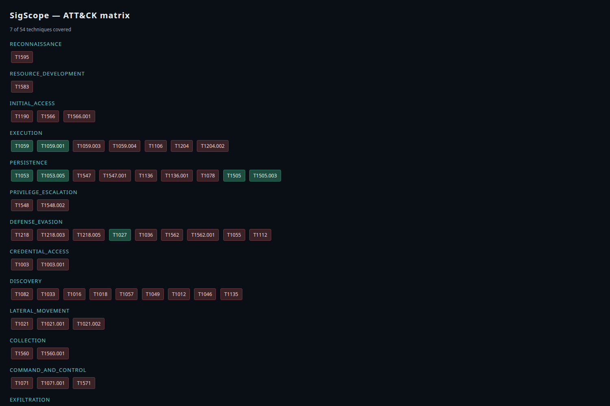
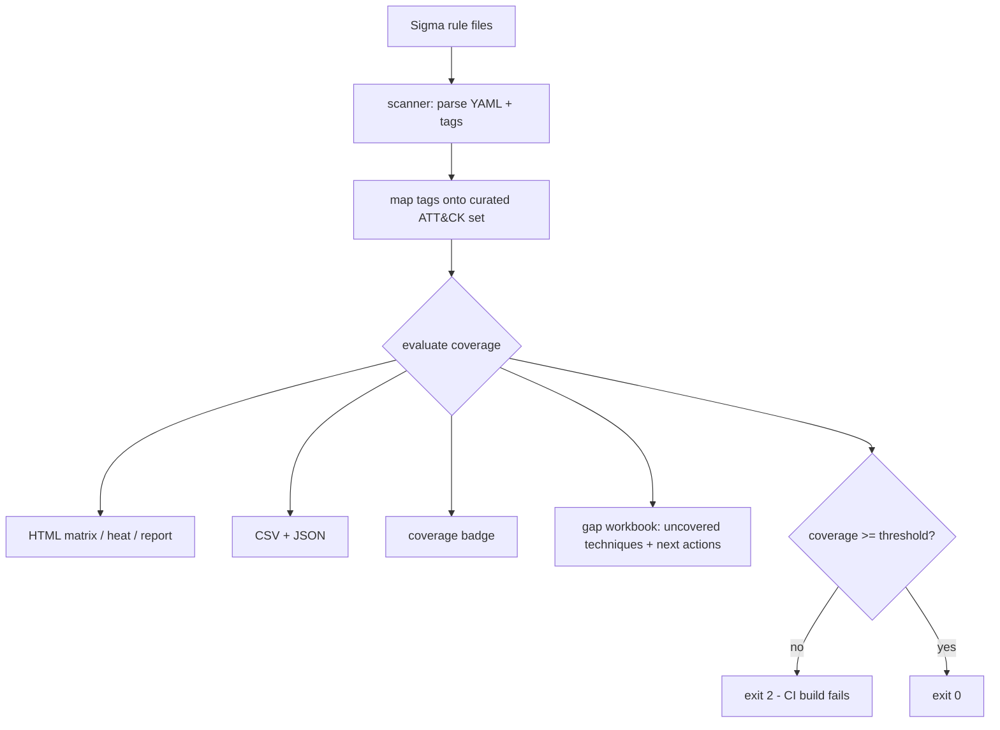

# SigScope

A small Python tool for detection engineers. It answers one question:
which MITRE ATT&CK techniques do my Sigma rules actually cover, and
where are the gaps?

It works fully offline, reads local rule files, and plugs into CI so
coverage regressions fail the build.

## Screenshot

Rendered matrix report from the bundled lynx rules:



## What it does

- parses Sigma rules from a directory
- matches each rule against a curated MITRE ATT&CK technique set
- reports coverage per tactic and technique
- renders the result in four HTML styles (matrix, rows, heatmap, report)
- optionally emits JSON, a coverage badge, and a Navigator-friendly
  export
- exits non-zero in CI mode when coverage drops below the threshold

## Install

```bash
pip install -e .
```

## Use

```bash
sig-scope rules --html report.html
sig-scope rules --ci --min-coverage 80
```

The `rules/` directory holds example Sigma rules. Point the command at
your own rule set in a real pipeline.

## Why it matters

Detection rules that are never mapped to ATT&CK drift silently. This
tool makes the drift visible. Wired into CI, a coverage drop becomes a
build failure instead of a surprise. Same detection-as-code discipline
large SOC teams use.

## Author

Boluwaji Oluwaseyi Adepoju

## License

MIT

## Flow


