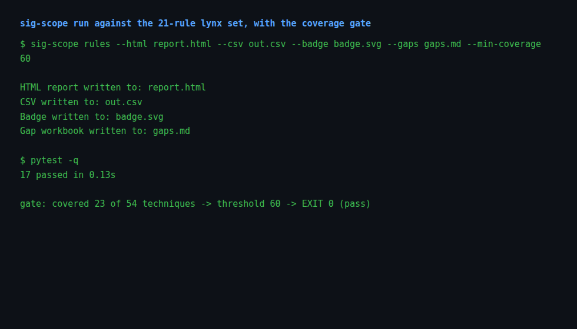
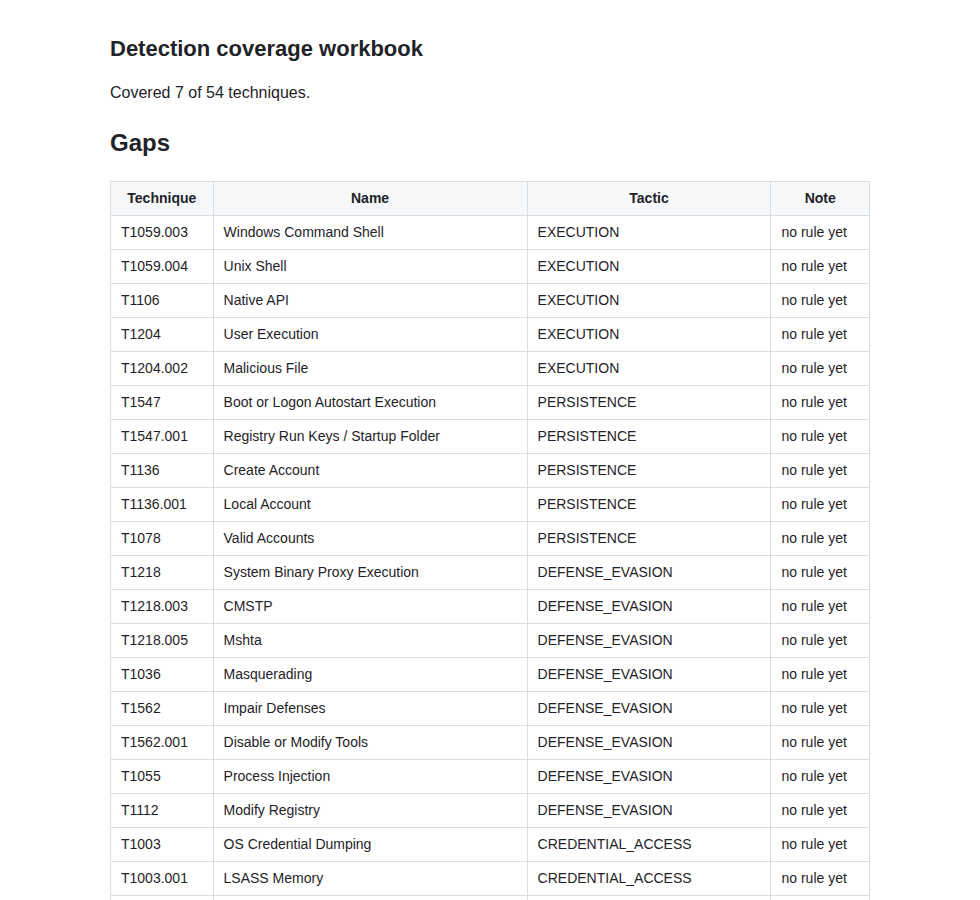
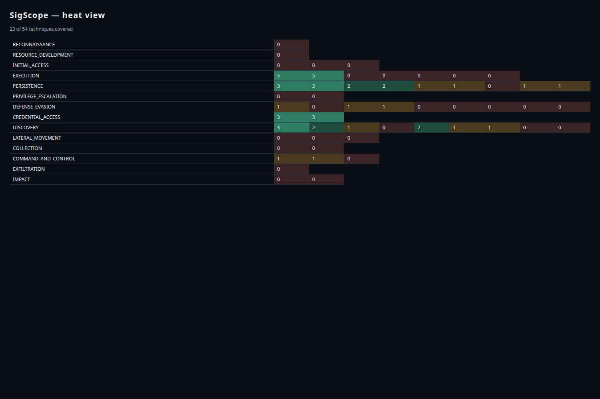
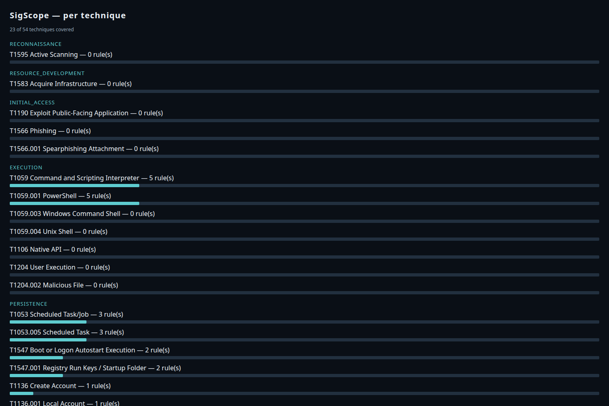
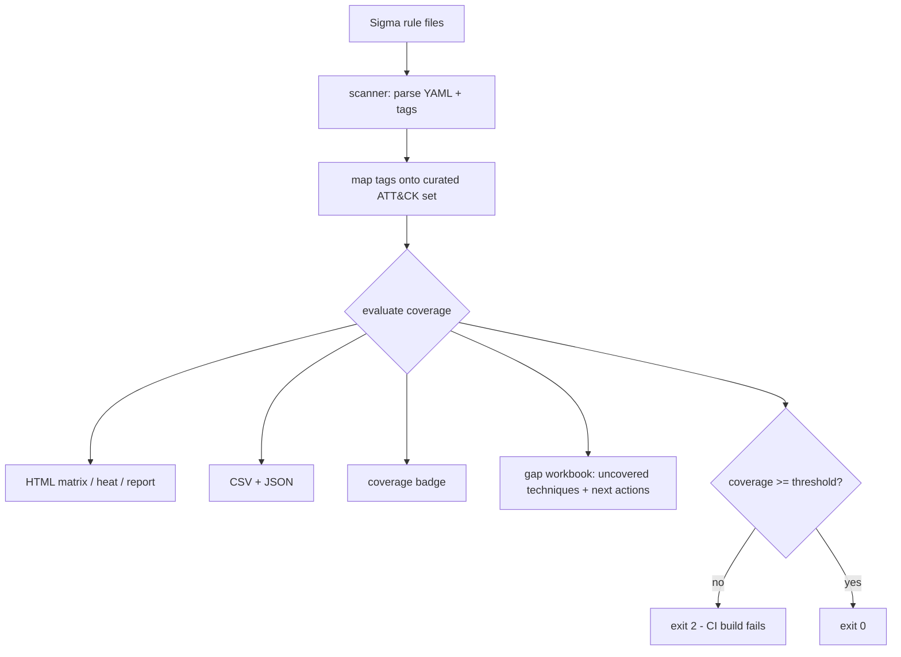

# SigScope

[](https://github.com/boluwajioadepojuw/SigScope/actions/workflows/ci.yml)

A small Python tool for detection engineers. It answers one question:
which MITRE ATT&CK techniques do my Sigma rules actually cover, and
where are the gaps?

It works fully offline, reads local rule files, and plugs into CI so
coverage regressions fail the build.

## Screenshot

Rendered matrix report from the bundled lynx rules:


CLI run with the coverage gate:



Gap workbook output:



Heatmap and rows views:





## What it does

- parses Sigma rules from a directory
- matches each rule against a curated MITRE ATT&CK technique set
- reports coverage per tactic and technique
- renders the result in four HTML styles (matrix, rows, heatmap, report)
- optionally emits JSON, a coverage badge, and an ATT&CK Navigator
  layer for visual review
- exits non-zero in CI mode when overall coverage (or any single
  tactic's coverage) drops below the threshold
- fails on unparseable rule files in --strict mode instead of letting
  broken rules silently erode the coverage picture

## Install

Local install:

```bash
pip install -e .
```

PyPI release: tagging a version (git tag v0.6.0 && git push --tags) runs
.github/workflows/publish.yml, which builds and publishes via PyPI trusted
publishing. One-time setup: create the project on pypi.org and add this
repository as a trusted publisher (Settings -> Publishing).

## Use

```bash
sig-scope rules --html report.html
sig-scope rules --html report.html --badge badge.svg --csv out.csv \
  --gaps gaps.md --navigator layer.json \
  --min-coverage 40 --strict
# per-tactic gate: scope to the tactics you write rules for
sig-scope rules --include execution,persistence \
  --min-tactic-coverage 25
```

- `--navigator` writes an ATT&CK Navigator layer: covered techniques
  score 100, gaps score 0. Load it at the ATT&CK Navigator site.
- `--strict` makes unparseable rule files fail the run instead of a
  warning.
- `--min-tactic-coverage` fails the gate when one tactic drops below
  the threshold, even if overall coverage still passes. Combine it with
  `--include`/`--ignore` (tactic names or technique prefixes, comma
  or space separated) to scope which tactics are gated.

The `rules/` directory holds example Sigma rules. Point the command at
your own rule set in a real pipeline.

## Why it matters

Detection rules that are never mapped to ATT&CK drift silently. This
tool makes the drift visible. Wired into CI, a coverage drop becomes a
build failure instead of a surprise. Same detection-as-code discipline
large SOC teams use.

## Related projects

- [SOCAtelier](https://github.com/boluwajioadepojuw/SOCAtelier) - the SOC lab where the bundled lynx rules fire
- [SplunkHarbor](https://github.com/boluwajioadepojuw/SplunkHarbor) - Splunk ingestion for the same Windows telemetry
- [IocVerdict](https://github.com/boluwajioadepojuw/IocVerdict) - IOC enrichment for the indicators the rules surface
- [DomainSieve](https://github.com/boluwajioadepojuw/DomainSieve) - NRD feed to Suricata rules on the gateway
- [ArpSieve](https://github.com/boluwajioadepojuw/ArpSieve) - ARP spoofing detection on the local segment

## Author

Boluwaji Oluwaseyi Adepoju

## License

MIT

## Flow


